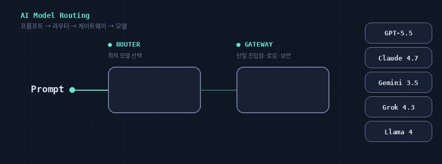

# ai-gateway

AI Gateway 및 LLM Router 개념 정리 + 주요 서비스들의 사용 예제 모음.



## 개념 요약

- **AI Gateway**: 다수 LLM provider 앞에 두는 통합 API/프록시 레이어. 인증/요금/로깅/페일오버/가드레일을 한 곳에서 처리.
- **LLM Router**: 입력 프롬프트의 특성에 따라 가장 적합한 모델(비용·품질·지연 트레이드오프)을 선택하는 결정 레이어.
- 자세한 비교는 [`docs/ai-gateway-vs-llm-router.md`](docs/ai-gateway-vs-llm-router.md) 참고.

## 선정 방침

채택 기준을 두지 않고 폭넓게 다룹니다. 다만 각 서비스의 **라이선스**(OSS/Proprietary)와 **비용**(무료/유료/부분 무료)을 표에 명시하고, 모드별로 갈리는 경우(예: OSS 셀프호스팅 vs 호스팅 SaaS) 각 README 에서 구분합니다.

전체 비교는 [`docs/services-overview.md`](docs/services-overview.md) 참고.

## 디렉토리 구조

```
ai-gateway/
├─ docs/                        개념 정리, 참고 링크, 서비스 비교 노트
├─ gateways/                    AI Gateway 서비스 예제 (provider 통합 / 프록시 / 게이트웨이)
└─ routers/                     LLM Router 서비스 예제 (모델 선택 결정 레이어)
```

폴더 안에 `python/` 또는 `typescript/` 가 있으면 코드 예제가 포함된 것이고, README 만 있으면 별도 게이트웨이 프로세스/K8s 등 인프라가 필요해 설명만 둔 케이스입니다.

## 채택된 서비스 (2026.05 기준)

### Gateway 카테고리

| 서비스 | 라이선스 | 비용 | 언어 SDK | 코드 예제 |
|---|---|---|---|---|
| [LiteLLM](./gateways/litellm/) | OSS (MIT, `enterprise/`는 상용) | 무료 (Cloud 매니지드는 유료) | Python only | ✅ |
| [Portkey Gateway](./gateways/portkey/) | OSS (MIT, 메인 LICENSE 기준) | 무료 (호스팅·엔터프라이즈는 유료) | Python + TS | ✅ |
| [Helicone](./gateways/helicone/) | OSS (Apache 2.0) | 무료 (호스팅 SaaS 는 부분 유료) | OpenAI SDK 재사용 (Py + TS) | ✅ |
| [OpenRouter](./gateways/openrouter/) | Proprietary (백엔드 closed) | 부분 무료 (BYOK 월 1M req 무료 / 크레딧 마진) | OpenAI 호환 (Py + TS) | ✅ |
| [Cloudflare AI Gateway](./gateways/cloudflare-ai-gateway/) | Proprietary | 부분 무료 (Workers 무료/유료 플랜) | OpenAI 호환 (Py + TS) | ✅ |
| [aisuite](./gateways/aisuite/) | OSS (MIT) | 무료 | Python only | ✅ |
| [Bifrost](./gateways/bifrost/) | OSS (Apache 2.0) | 무료 (Maxim 매니지드는 유료) | 게이트웨이 서버 (언어 무관) | ❌ (README only) |
| [Kong AI Gateway](./gateways/kong-ai-gateway/) | OSS (Apache 2.0) + 상용 Enterprise/Konnect | 부분 유료 (OSS 무료, 상용 플러그인 유료) | 게이트웨이 서버 | ❌ (README only) |
| [AWS Bedrock](./gateways/aws-bedrock/) | Proprietary | 종량제 유료 | boto3 / AWS SDK | ❌ (README only) |
| [Apache APISIX (AI Gateway)](./gateways/apisix-ai-gateway/) | OSS (Apache 2.0) | 무료 (API7 매니지드는 유료) | 게이트웨이 서버 | ❌ (README only) |
| [Envoy AI Gateway](./gateways/envoy-ai-gateway/) | OSS (Apache 2.0) | 무료 | K8s 게이트웨이 | ❌ (README only) |
| [MLflow AI Gateway](./gateways/mlflow-ai-gateway/) | OSS (Apache 2.0) | 무료 | MLflow Python 서버 | ❌ (README only) |

### Router 카테고리

| 서비스 | 라이선스 | 비용 | 언어 SDK | 코드 예제 | 유지보수 |
|---|---|---|---|---|---|
| [vLLM Semantic Router](./routers/vllm-semantic-router/) | OSS (Apache 2.0) | 무료 | Envoy ExtProc 서버 | ❌ (README only) | 🟢 활발 (~2026-05) |
| [NVIDIA LLM Router (Blueprint)](./routers/nvidia-llm-router/) | OSS (Apache 2.0, 모델은 별도 라이선스) | 무료 (NIM 호스팅 비용 별도) | NIM/Triton 서버 | ❌ (README only) | 🟢 활발 (~2026-05) |
| [RouteLLM](./routers/routellm/) | OSS (Apache 2.0) | 무료 | Python only | ✅ | 🔴 정체 (2024-08~) |
| [Not Diamond](./routers/notdiamond/) | Proprietary | 부분 무료 (free tier + 유료) | Python + TS SDK | ✅ | ⚠️ SDK 아카이브 (2025-12) |
| [Martian](./routers/martian/) | Proprietary (백엔드 closed) | 부분 무료 (개발자 2,500 req 무료) | OpenAI 호환 (Py + TS) | ✅ | ⚫ 측정 불가 (closed) |

> 비고: `gateways/` vs `routers/` 분류는 **1차 책임 레이어** 기준입니다. LiteLLM 처럼 라우팅 기능도 갖춘 게이트웨이는 Gateway 로 분류했습니다.

## 예제 실행 원칙

- 모든 예제는 환경변수만 채우면 즉시 실행 가능 (`.env.example` 참고).
- 실제 키는 절대 커밋하지 않습니다 (`.gitignore`에 `.env` 포함).
- Python 예제는 `requirements.txt`, TS 예제는 `package.json` 으로 의존성 관리.

## 기여

각 작업은 의미 단위로 개별 커밋합니다. 커밋 메시지는 한국어 사용.
